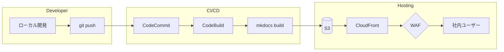
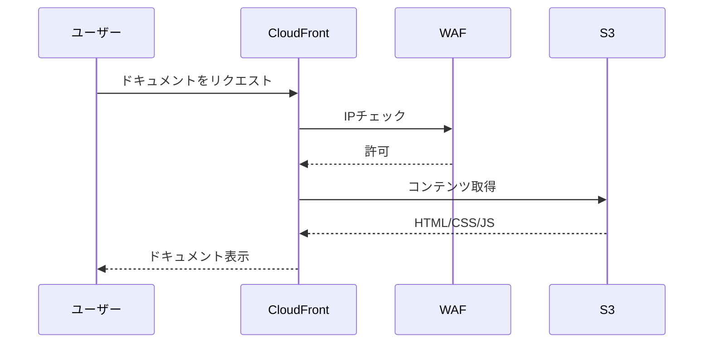
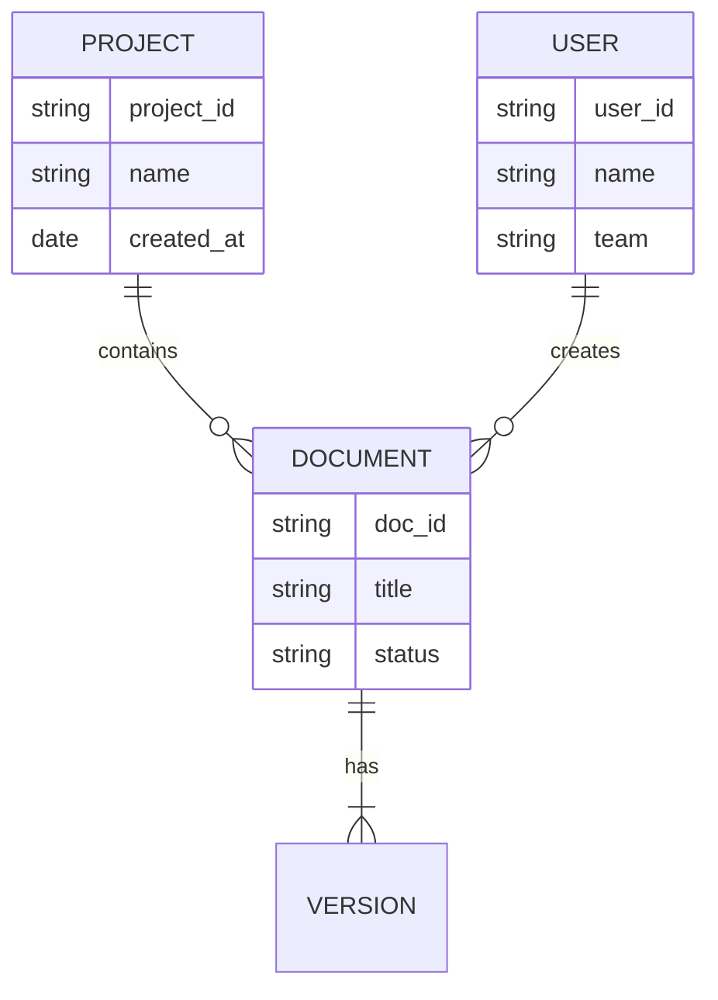

# CCoE ドキュメントサンプル

このページでは、MkDocs Material テーマの表現力を紹介します。

## Mermaid ダイアグラム

### アーキテクチャ図



### シーケンス図



### ER図



## Admonitions（注意書きボックス）

!!! note "メモ"
    これは補足情報を伝えるためのボックスです。
    複数行にわたる説明も書けます。

!!! warning "注意"
    本番環境で実行する前に、必ずステージング環境でテストしてください。

!!! danger "危険"
    この操作は取り消せません。実行前に必ずバックアップを取得してください。

!!! tip "ヒント"
    `mkdocs serve` で変更をリアルタイムにプレビューできます。

!!! example "例"
    ```bash
    aws s3 sync ./site s3://my-docs-bucket --delete
    ```

??? info "折りたたみ可能なボックス（クリックして展開）"
    このボックスはデフォルトで閉じています。
    詳細情報や長い説明を隠しておきたい場合に便利です。

???+ success "デフォルトで開いている折りたたみボックス"
    `???+` を使うとデフォルトで開いた状態になります。

## コンテンツタブ

手順をコンソール/CLI/IaCで切り替えて表示できます。

=== "AWSコンソール"

    1. S3コンソールにアクセス
    2. 「バケットを作成」をクリック
    3. バケット名を入力
    4. リージョンを選択
    5. 「バケットを作成」をクリック

=== "AWS CLI"

    ```bash
    aws s3 mb s3://my-docs-bucket --region ap-northeast-1
    ```

=== "Terraform"

    ```hcl
    resource "aws_s3_bucket" "docs" {
      bucket = "my-docs-bucket"

      tags = {
        Name        = "CCoE Documents"
        Environment = "production"
      }
    }
    ```

=== "CDK (TypeScript)"

    ```typescript
    import * as s3 from 'aws-cdk-lib/aws-s3';

    const docsBucket = new s3.Bucket(this, 'DocsBucket', {
      bucketName: 'my-docs-bucket',
      versioned: true,
      encryption: s3.BucketEncryption.S3_MANAGED,
    });
    ```

## コードブロック

### シンタックスハイライト + 行番号 + コピーボタン

```python linenums="1" title="deploy.py"
import boto3
import subprocess

def build_docs():
    """MkDocsのビルドを実行"""
    subprocess.run(["mkdocs", "build"], check=True)

def upload_to_s3(bucket_name: str):
    """S3にアップロード"""
    s3 = boto3.client("s3")
    # site/ ディレクトリの内容をアップロード
    for file in Path("site").rglob("*"):
        if file.is_file():
            s3.upload_file(str(file), bucket_name, str(file.relative_to("site")))

if __name__ == "__main__":
    build_docs()
    upload_to_s3("my-docs-bucket")
```

### 特定行のハイライト

```yaml hl_lines="3 4 5"
theme:
  name: material
  palette:
    scheme: slate
    primary: indigo
  features:
    - navigation.tabs
```

## テーブル

| サービス | 用途 | 月額概算 |
|---------|------|---------|
| S3 | 静的ファイルホスティング | ~$1 |
| CloudFront | CDN配信 | ~$5 |
| WAF | アクセス制御 | ~$5 |
| CodeBuild | CI/CD | ~$1 |

## タスクリスト

- [x] MkDocs プロジェクト作成
- [x] mkdocs-material テーマ設定
- [ ] CI/CD パイプライン構築
- [ ] S3 + CloudFront 構築
- [ ] WAF ルール設定
- [ ] 本番デプロイ

## キーボードキー表示

++ctrl+shift+p++ でコマンドパレットを開く

++cmd+s++ で保存（Mac）

## テキスト装飾

- ==ハイライト== で強調
- ~~取り消し線~~
- ^^上付き^^文字
- ,,下付き,,文字
- `インラインコード`

## 絵文字

:rocket: デプロイ完了！
:warning: 注意が必要です
:white_check_mark: テスト成功
:x: テスト失敗
