# Mermaid ダイアグラム集

LLMに「こういう図描いて」と言えばすぐ作れる。これがMermaidの強み。

## AWS構成図（実践的なパターン）

### Web3層 + RDS構成

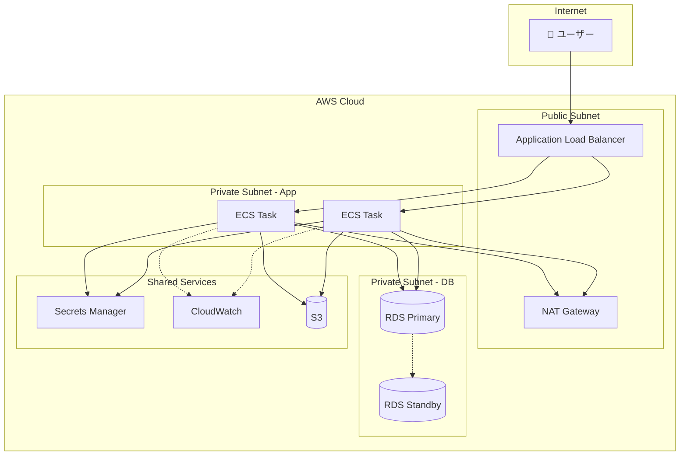

### サーバーレス API パターン

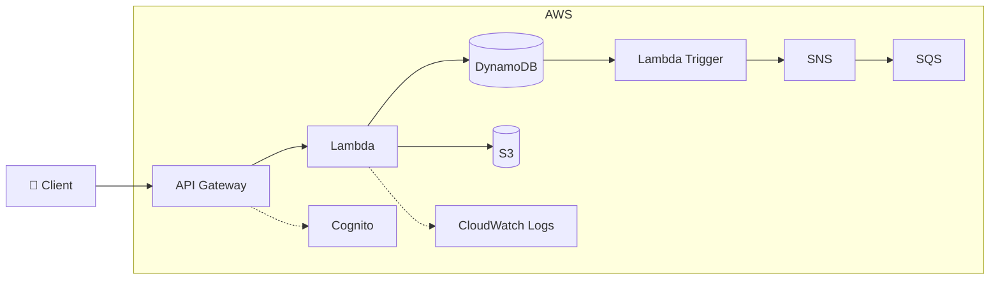

### マルチアカウント構成

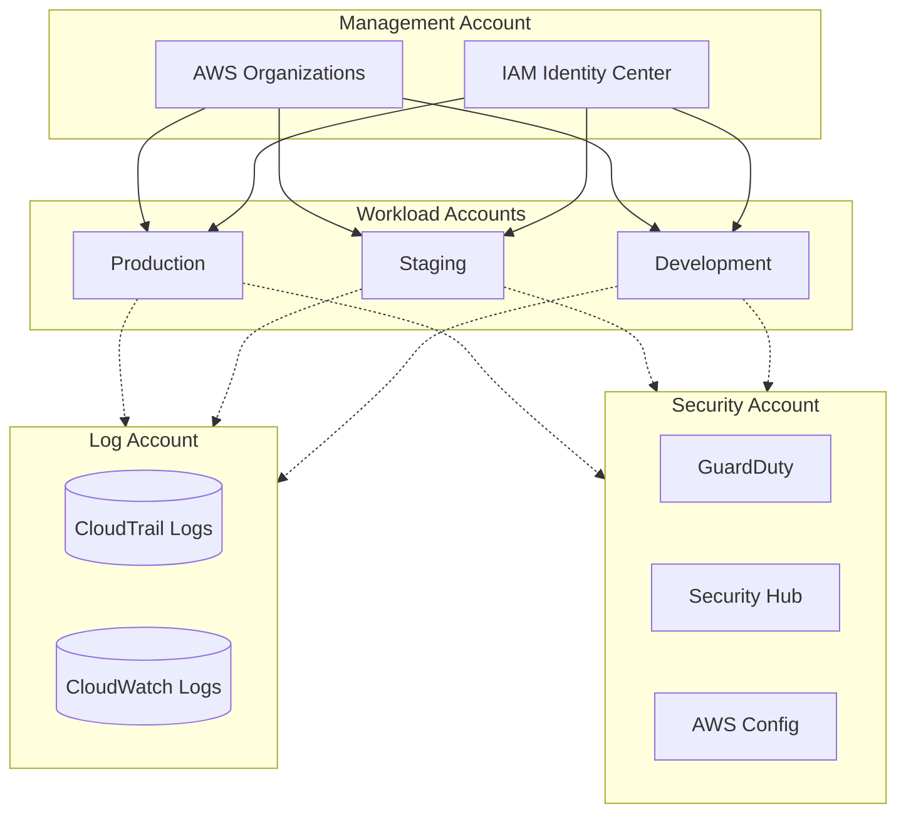

## シーケンス図（詳細版）

### OAuth2.0 認証フロー

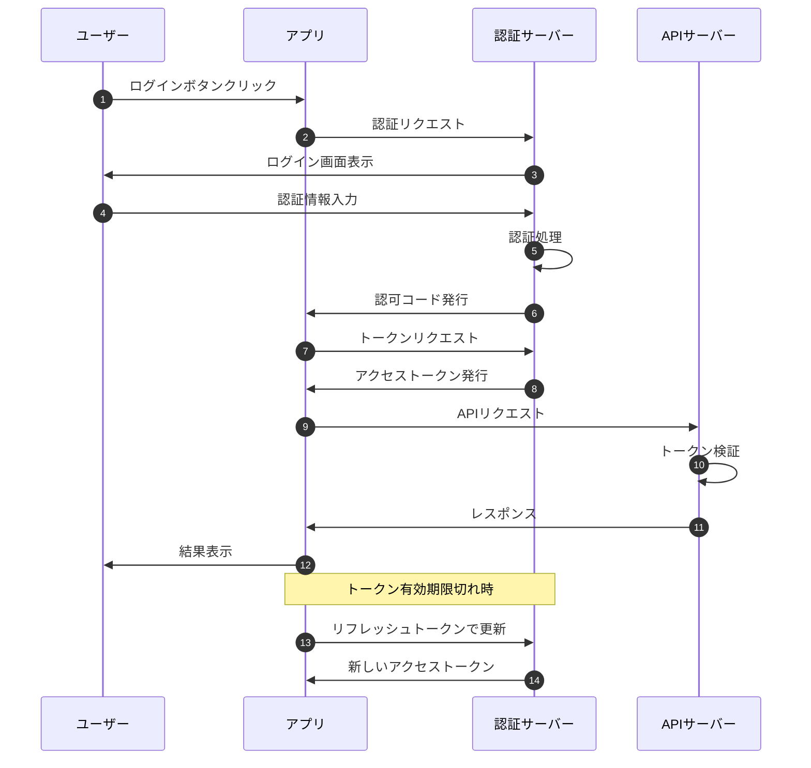

### 障害発生時のエスカレーション

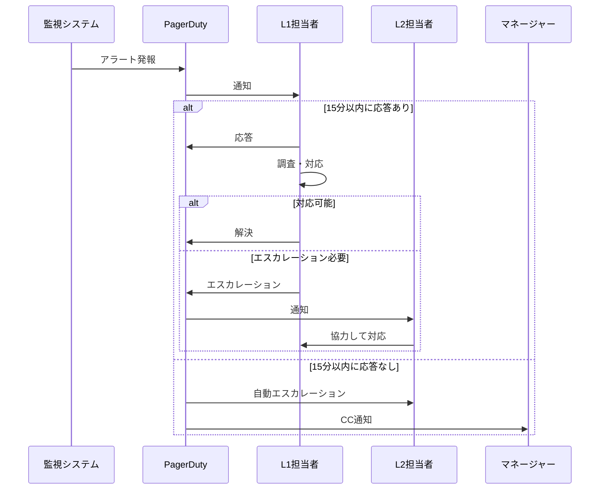

## 状態遷移図

### デプロイパイプラインの状態

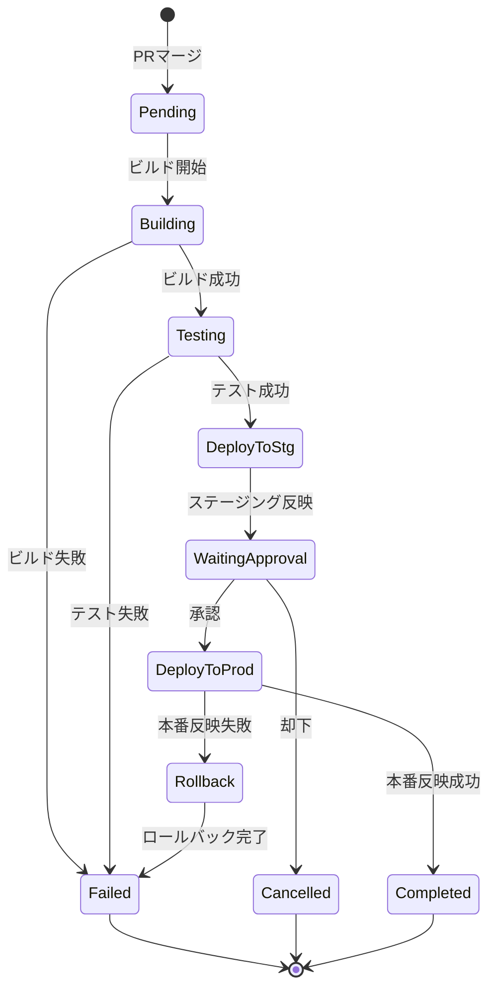

### インシデント対応ステータス

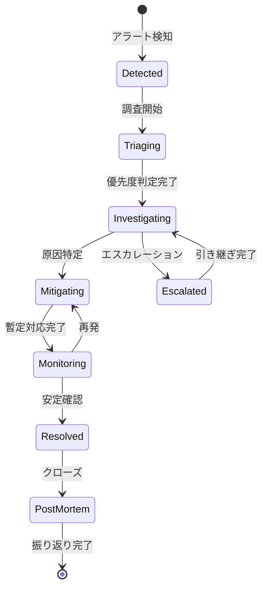

## Gitブランチ戦略

### Git-flow（フローチャート表現）

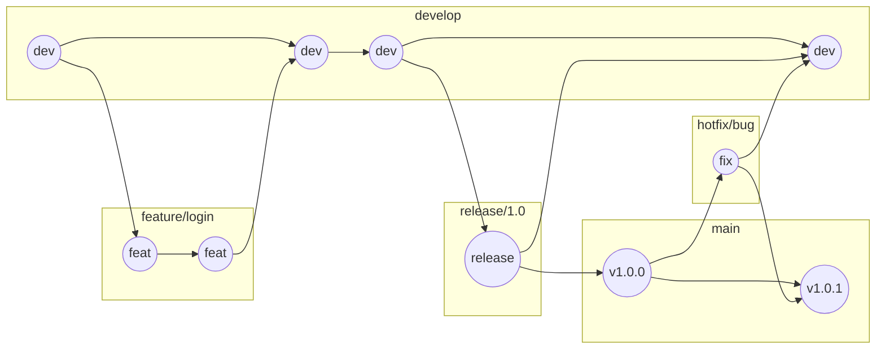

## ガントチャート

### プロジェクトスケジュール

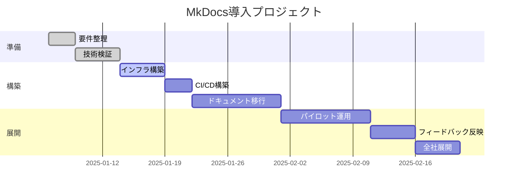

## ER図（詳細版）

### ドキュメント管理システム

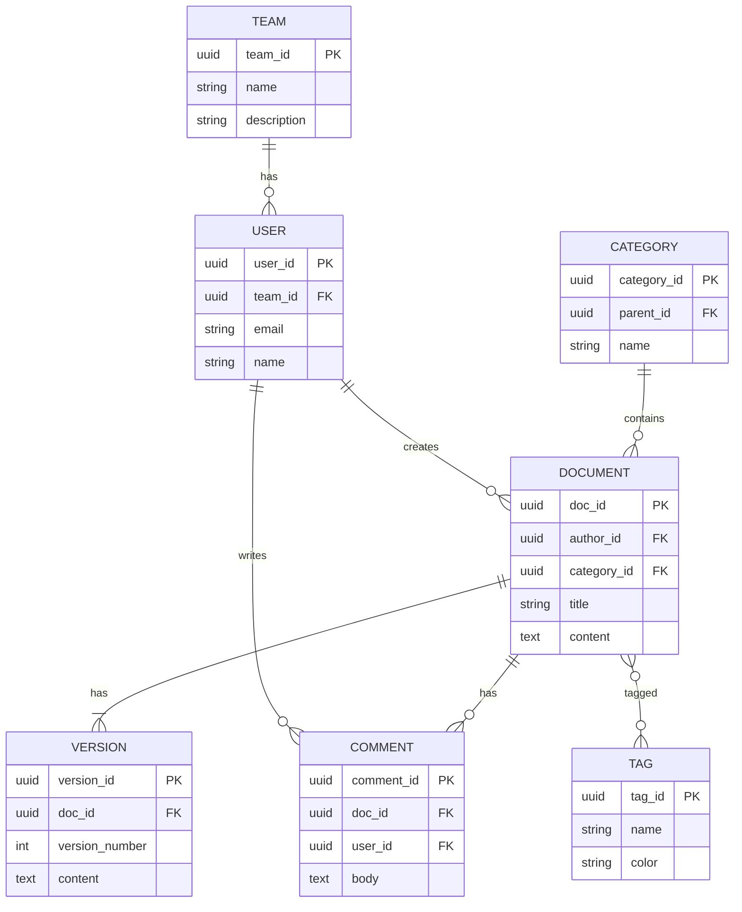

## 円グラフ

### インシデント原因分析

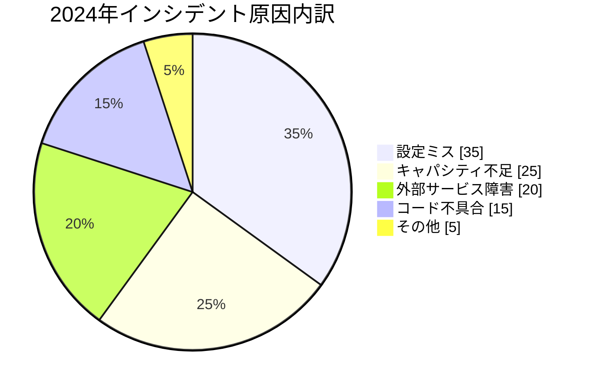

## システムコンテキスト図

### ドキュメント管理システム全体像

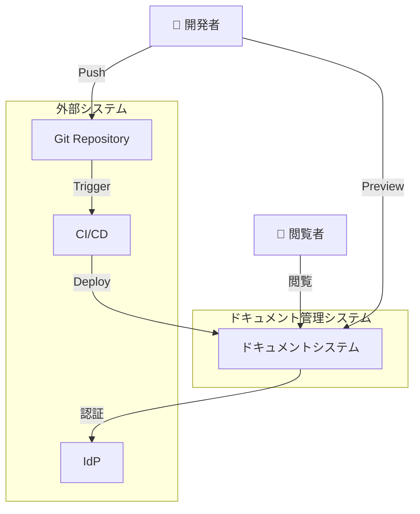

## サービス分類図

### AWSサービスカテゴリ

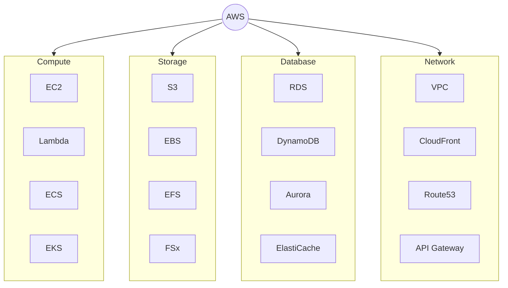

---

!!! tip "LLMとの協働"
    これらの図は全て「こういう図を描いて」と言えば生成できる。
    修正も「ここをこう変えて」と言えばすぐ対応可能。
    作図ツールでポチポチする時代は終わり！
