# Mermaid ダイアグラム集

LLMに「こういう図描いて」と言えばすぐ作れる。これがMermaidの強み。

## AWS構成図（実践的なパターン）

### Web3層 + RDS構成

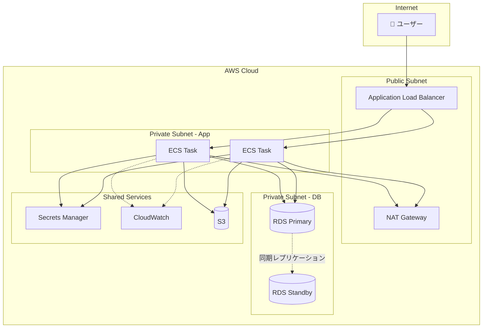

### サーバーレス API パターン

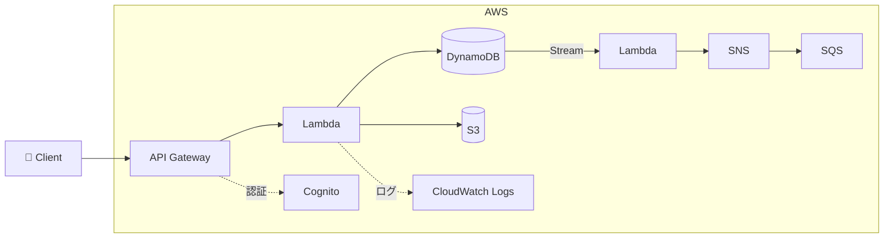

### マルチアカウント構成

```mermaid
flowchart TB
    subgraph Management Account
        Org[AWS Organizations]
        SSO[IAM Identity Center]
    end

    subgraph Security Account
        GuardDuty[GuardDuty]
        SecurityHub[Security Hub]
        Config[AWS Config]
    end

    subgraph Log Account
        CT[(CloudTrail Logs)]
        CWL[(CloudWatch Logs)]
    end

    subgraph Workload Accounts
        subgraph Production
            Prod[本番環境]
        end
        subgraph Staging
            Stg[検証環境]
        end
        subgraph Development
            Dev[開発環境]
        end
    end

    Org --> |管理| Production & Staging & Development
    SSO --> |認証| Production & Staging & Development
    Production & Staging & Development -.-> |ログ集約| Log Account
    Production & Staging & Development -.-> |セキュリティ監視| Security Account
```

## シーケンス図（詳細版）

### OAuth2.0 認証フロー

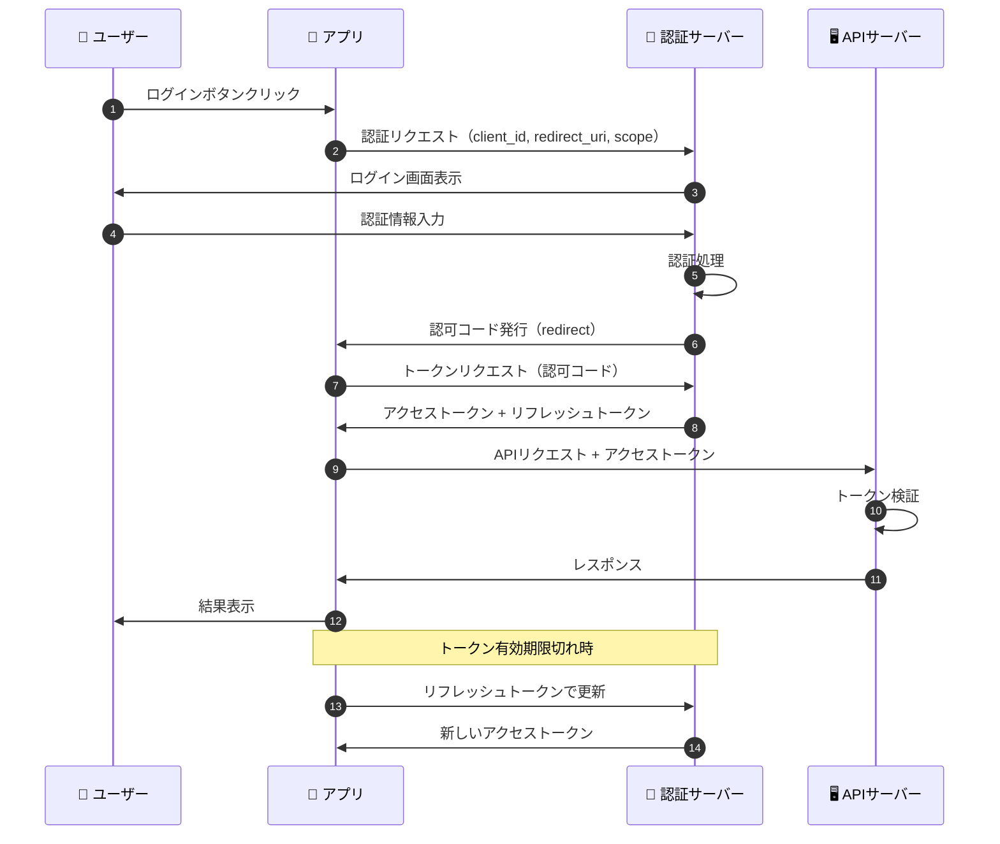

### 障害発生時のエスカレーション

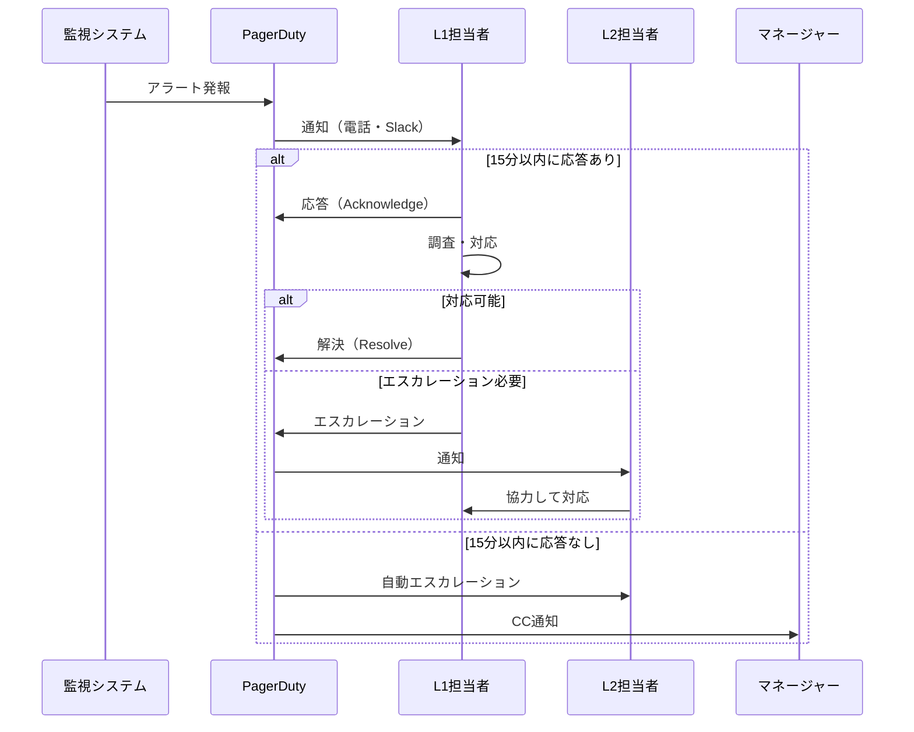

## 状態遷移図

### デプロイパイプラインの状態

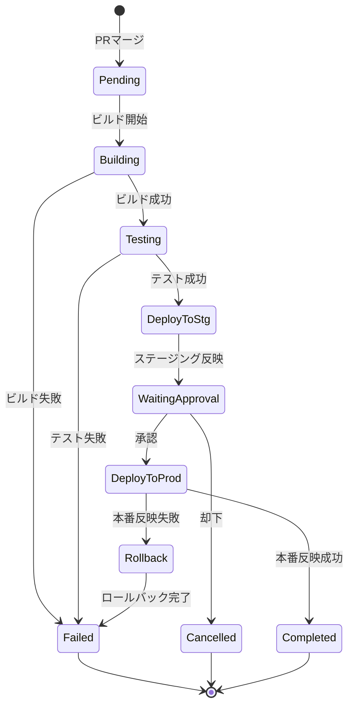

### インシデント対応ステータス

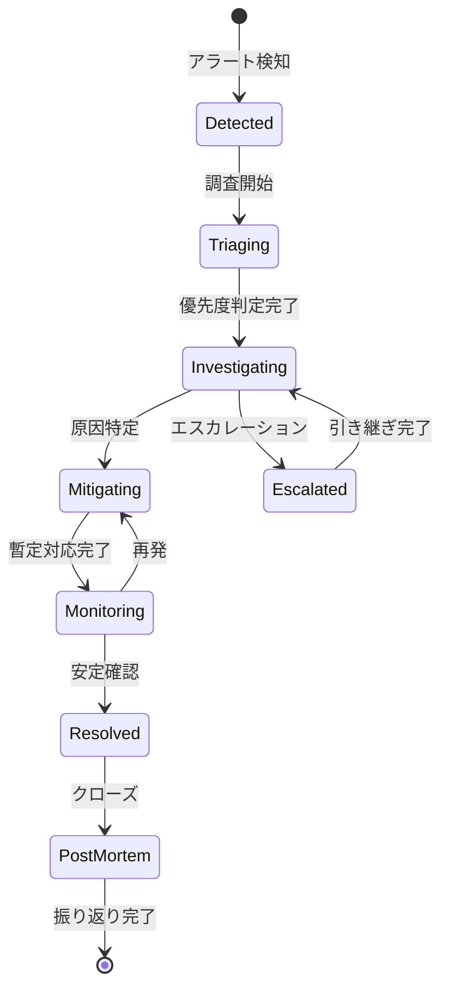

## Gitブランチ戦略

### Git-flow

```mermaid
gitgraph
    commit id: "init"
    branch develop
    checkout develop
    commit id: "dev-1"
    
    branch feature/login
    commit id: "feat-1"
    commit id: "feat-2"
    checkout develop
    merge feature/login id: "merge-feat"
    
    branch release/1.0
    commit id: "bump-ver"
    checkout main
    merge release/1.0 id: "v1.0" tag: "v1.0.0"
    checkout develop
    merge release/1.0

    checkout main
    branch hotfix/bug
    commit id: "fix"
    checkout main
    merge hotfix/bug id: "v1.0.1" tag: "v1.0.1"
    checkout develop
    merge hotfix/bug
```

## ガントチャート

### プロジェクトスケジュール

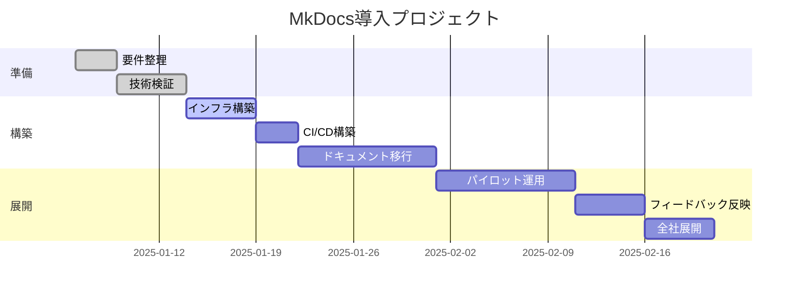

## ER図（詳細版）

### ドキュメント管理システム

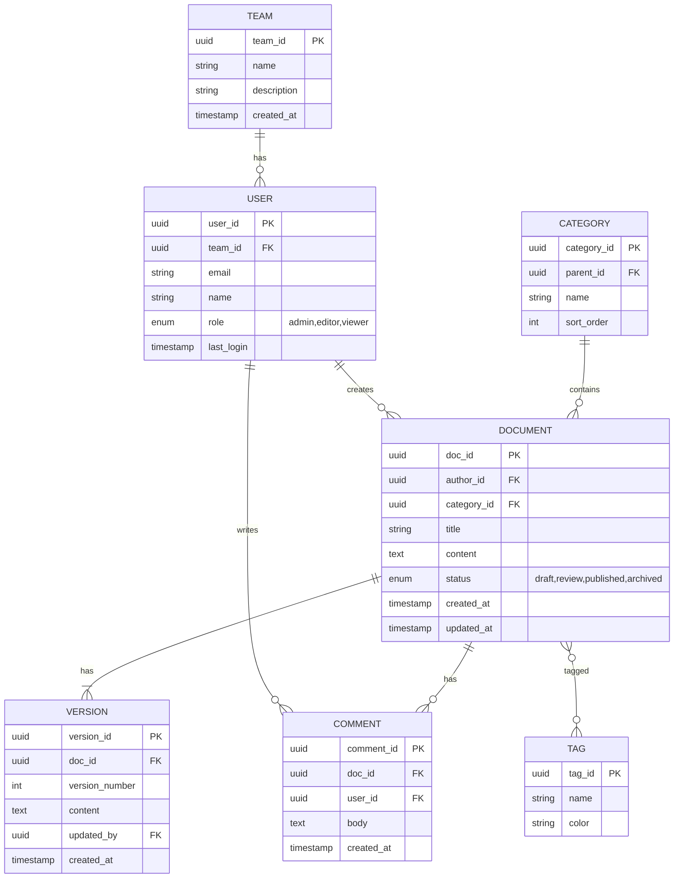

## 円グラフ

### インシデント原因分析

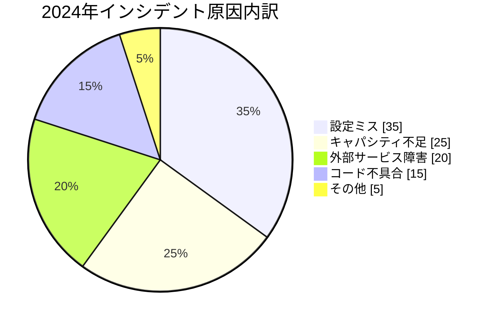

## C4モデル（システムコンテキスト図）

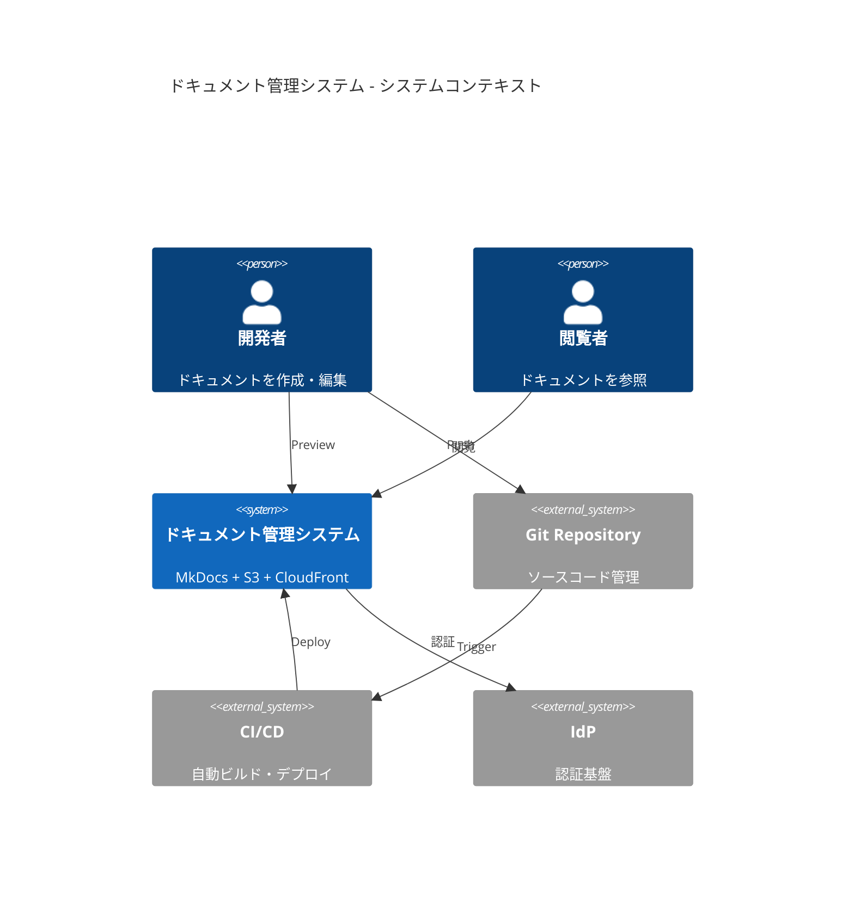

## マインドマップ

### AWSサービス分類

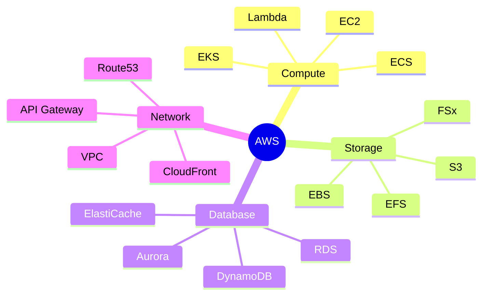

---

!!! tip "LLMとの協働"
    これらの図は全て「こういう図を描いて」と言えば生成できる。
    修正も「ここをこう変えて」と言えばすぐ対応可能。
    作図ツールでポチポチする時代は終わり！
